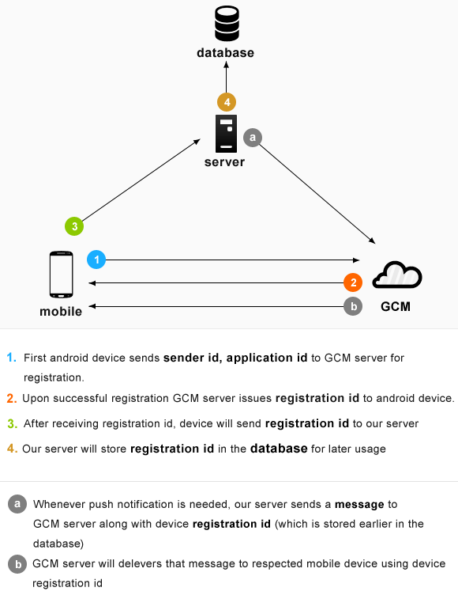
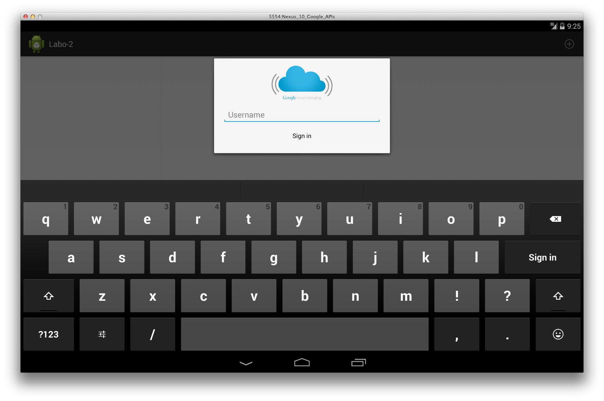
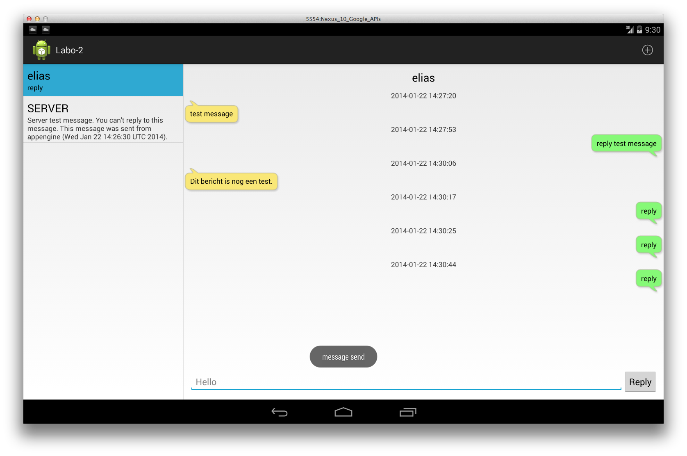

Design and Development of Mobile Applications
===
Elias De Coninck -  Pieter Simoens
#Lab 2 - Mobile Cloud Integration

##Goal
The goal is to build a ChatApplication. Each application deployed on the devices throughout the class room will be clients for the same chat room. 

Communication is established over Google Cloud Messaging. Google Cloud Messaging for Android (GCM) is a service that allows you to send data from your server to your users' Android-powered device, and also to receive messages from devices on the same connection. The GCM service handles all aspects of queueing of messages and delivery to the target Android application running on the target device. GCM is completely free no matter how big your messaging needs are, and there are no quotas.

<div align="center"></div>

The goals of this session include: 

- Using Activities, IntentServices and BroadcastReceivers
- Creating user notifications
- Background tasks with Asynctasks to keep responsive front end
- Using the Google Play Services SDK and APIs
- Google Cloud Messaging (GCM) communication
- Third party application server communication
- Create [GCM Client](http://developer.android.com/google/gcm/client.html)
- Set up Httprequests

<div align="center"></div>

##Preparation
You need to install the Google Play Services SDK and the Google API SDK.

###Android SDK Manager 
 - Check if Google APIs is installed
 - Check if Google Play services is installed (extras folder)

###Android Virtual Device Manager
To test your app when using the Google Play services SDK, you must use either have a compatible Android device that runs Android 2.3 or higher and includes Google Play Store, or use the Android emulator with an AVD that runs the Google APIs platform based on Android 4.2.2 or higher.

Create a new (or edit your existing) virtual device that uses the most recent API version, and select Google APIs as target <br /> This will make the Google apps and Google Play Services available on the emulator. If you cannot find the Google APIs as target although you successfully completed the previous step, you should restart Eclipse.

##[Setup Play services](https://developer.android.com/google/play-services/index.html) and application project
To develop an app using the Google Play services APIs, you must download the Google Play services SDK from the SDK Manager. The download includes the client library and code samples.

- Import and copy the library project `<android-sdk>/extras/google/google_play_services/libproject/google-play-services-lib` into the workspace of Eclipse. (File -> Import -> Android Project from existing source)
- Clone the Labo-2-GCMChatClient Android application. Use your UGent username and password.

		git clone https://github.ugent.be/OOMO/Labo-2.git

- Import and copy this project in your workspace.
- Make sure that both the copy of the library project and the cloned project are in the same workspace folder.
- In the GCMChatClient project, add the reference to the Play Service library project that is in the same workspace folder (Properties -> Android -> Library). Also make sure that your build target is set to the Google API's.
- Update the AndroidManifest to use Google Play Services. The version number variable is specified in `res/values/version.xml` resource of the library project.
	- Referencing integer resource of projects:
		- In Java: `R.integer.variable_name`
		- In XML: `@integer/variable_name`
	- Referencing integer resource of sdk:
		- In Java: `android.R.integer.variable_name`
		- In XML: `@android:integer/variable_name`

```html
<application ...>
	<meta-data android:name="com.google.android.gms.version" android:value="@integer/google_play_services_version" />
	...
</application>
```

##Checking the availability of Google Play Services in your app

Because it is hard to anticipate the state of each device, you must always check for a compatible Google Play services APK before you access Google Play services features. For many apps, the best time to check is during the onResume() method of the main activity. This avoids corner cases where the user removed the Google Play services while the activity was invisible. Of course, nothing prevents you to add the same code in onResume() of all activities. More information can be found [here](http://www.androiddesignpatterns.com/2013/01/google-play-services-setup.html) (Verifying Google Play Services).

Here are four scenarios that describe the possible state of the Google Play services APK on a user's device:

1. A recent version of the Google Play Store app is installed, and the most recent Google Play services APK has been downloaded.
2. A recent version of the Google Play Store app is installed, but the most recent Google Play services APK has not been downloaded.
3. An old version of the Google Play Store app, which does not proactively download Google Play services updates, is present.
4. The Google Play services APK is missing or disabled on the device, which might happen if the user explicitly uninstalls or disables it.

Implement checkPlayServices() in ChatMessageListActivity (main activity) <br /> This method is called on resuming the main activity. If a correct version of the Play services is installed return true and a login dialog will be shown.

Test the application and update Google Play services if necessary (most devices have older version).

##Registration with GCM and application server
When the correct version of Google Play Services is found on the device a login dialog is shown.

First, update the AndroidManifest to use the following permissions:

- `android.permission.INTERNET` => GCM connects to Google Services.
- `android.permission.GET_ACCOUNTS` => GCM registration requires a Google account. (necessary only if if the device is running a version lower than Android 4.0.4)
- `com.google.android.c2dm.permission.RECEIVE` => This app needs permissions to register to GCM and receive data messages from GCM.

Second, add a custom permission so only this app can receive messages sent from this application. Keep in mind that the prefix of this permission needs to be your own package structure (`be.ugent.oomo.labo_2`).

```html
<!-- Creates a custom permission so only this app can receive its messages.
NOTE: the permission *must* be called PACKAGE.permission.C2D_MESSAGE,
where PACKAGE is the application's package name. -->
<permission 
android:name="applicationPackage + .permission.C2D_MESSAGE"
android:protectionLevel="signature" />
<uses-permission 
android:name="applicationPackage + .permission.C2D_MESSAGE" />
```

The relevant application logic is found in 3 places:

###CommonUtilities <br /> 
Public shared properties and methods:

 - `SERVER_URL = "http://secret-sphinx-425.appspot.com"` <br /> The URL of our chat application server. Update this line if needed.
 - `SENDER_ID = "646489753422"` <br /> This value represents the application registration id on Google Cloud Messaging. This project is preconfigured and can be used to send messages to a registered device.
 - `getGcmPreferences()`: returns the preferences saved for this application.

###GcmRegistrar
This class is used for all communication with GCM.

 - Implement the method 'register'
	- Contact GoogleCloudMessaging and store the returned registration id in the preferences. Use the provided method to store the id (`storeRegistrationId(Context, String)`).
	- If gcm variable is `null` get new instance of `GoogleCloudMessaging` with `GoogleCloudMessaging.getInstance(Context)`.
	- throw a GcmException when an error occurs.
 - Implement the method 'unregister'
	- Contact GoogleCloudMessaging for deregistration, and clear the registration id by using the provided method (`clearRegistrationId(Context)`).
	- throw a GcmException when an error occurs.

###ChatServerUtilities

This class is used for all communication to the application server.

 - Method `registerOnServer(Context, String, String)` <br /> After receiving the registration id of GCM we need to register a username and the registration id to the application server. This method sends a post to the chat server with parameters `regId` and `user`.
 - The method `unregisterOnServer(Context, String)` sends a post request to the chat server with a single parameter `regId`.
 - Implement the post method in ChatServerUtilities.java which is used in registerOnServer, unregisterOnServer, sendMessage, ... (More info: [Connect and Download Data](http://developer.android.com/training/basics/network-ops/connecting.html#download))
	- Open a connection (HttpURLConnection) from a URL based on the received endpoint.
	- Setup the HttpURLConnection
	- Make sure the required parameters are transmitted in the request.
		- Create String from parameters: `key1=value1&key2=value2&...`
		- Write the byte array of the String to the connection's outputstream.
		
```java
HttpURLConnection conn = (HttpURLConnection) url.openConnection();
conn.setDoOutput(true);
conn.setUseCaches(false);
conn.setRequestMethod("POST");
conn.setRequestProperty("Content-Type", "application/x-www-form-urlencoded;charset=UTF-8");
conn.setFixedLengthStreamingMode(length of byte array to send);
```
	- Handle the response code of the Connection object (`getResponseCode()`)
		- 200 => OK
		- All other codes (400): the server sends messages back with an error statement (`getErrorStream()`). You should throw a ServerException when the status is not 200.
	
##Send messages to application server
Add the functionality to send messages. Each message is sent to a specific username. This can be done by calling the method 'sendMessageAsync', which is already implemented. In turn, this method will call ChatServerUtilities.sendMessage and save this message when sending was successfully.

- Implement sendMessage in ChatServerUtilities
 - Parameters: sender, message, receiver
 - send post message to `CommonUtilities.SERVER_URL + "/sendChatMessage"`
 - when error occurs throw ServerException.

##Receiving messages from GCM (Does not work on UGent network)
Receiving messages from GCM is blocked by the ugent firewall. This means that actually receiving messages from GCM can not be tested on the wireless or wired connections of the school. If you have a phone with Edge or 3G you can test this part.

The BroadcastReceiver will be listening for received intents. In turn, it will invoke an IntentService to handle the message received from the server. 
More information can be found [here](http://developer.android.com/google/gcm/client.html#sample-receive)

- Create a class which extends IntentService
	- Override onHandleIntent
		- the Intent extras contains the message and sender, with the following keys:
			- `DatabaseContract.Message.COLUMN_NAME_CONTACT`
			- `DatabaseContract.Message.COLUMN_NAME_MESSAGE`
		- Save the received message with the provided ChatServerUtilities.saveMessage method
		- Create a notification
			- Create a new intent with target ChatMessageListActivity and parameter `DatabaseContract.Message.COLUMN_NAME_CONTACT`.
			- Use NotificationCompat.Builder and NotificationManager.
		- Release the wake lock provided by the WakefulBroadcastReceiver.
	- Add your service to the AndroidManifest
- Create a class which extends WakefulBroadcastReceiver
	- Override onReceive
		- start a wakeful service
		- set the result code to `Activity.RESULT_OK`
	- Add your receiver component to the AndroidManifest

```html
<receiver
 android:name="be.ugent.oomo.labo_2.utilities...."
 android:permission="com.google.android.c2dm.permission.SEND" >
 <intent-filter>
  <!-- Receives the actual messages. -->
  <action android:name="com.google.android.c2dm.intent.RECEIVE" /> 
  <!-- Receives the registration id. -->
  <action android:name="com.google.android.c2dm.intent.REGISTRATION" />
  <category android:name="be.ugent.oomo.labo_2" />
 </intent-filter>
</receiver>
```

- Update AndroidManifest with correct permissions
	- `android.permission.WAKE_LOCK` => keeps the processor from sleeping when a message is received and handled.	

From this moment, your application can receive GCM messages, sent to all devices registered, as well as messages that were only directed to you. Ask the lab supervisor to transmit a test message when you want to try your application.

##Submit assignment
Zip your project and name the resulting file as `NAME_OOMO_LAB_2.zip` and upload your file to the Minerva dropbox.

If needed, add a STATUS.txt file to describe missing functionality.